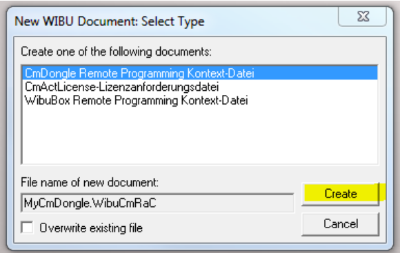
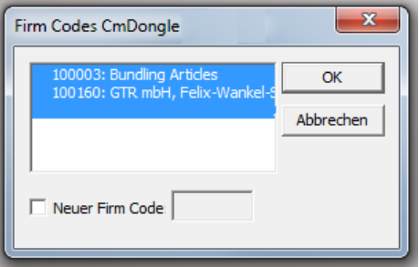
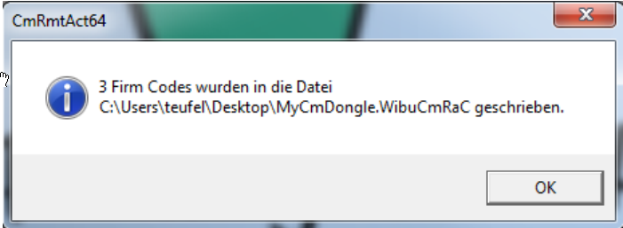
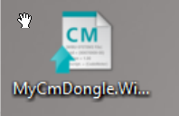

### Q: How can I manually create a control file for a CodeMeter Dongle?

### A: Create CodeMeter Content file for remote activation

> [!hint]
> If you have an up to date verion of the ProfDia Toolbox (2019 or later) you can use     the inbuild function.
> Otherwise you can create a control file as described in this chapter.
> 

1. Ensure that the Dongle is plugged in and the CodeMeter runtime is installed. 
2. Right click on Windows Desktop 
3. Select new > Wibu Control File 
 
4. CmDongle Remote Programming Context-File is selected by default 
5. Click on create 
 
6. Make sure that the item **100160** is selected and Click on ok 
7. Wait for the process to be finished 
 
8. Click ok to close the dialog 
9. Find the newely created file "MyCodeMeter.WibuCmRaC" on the Windows Desktop 
 
10. Send this file by e-mail to your GTR contact. 