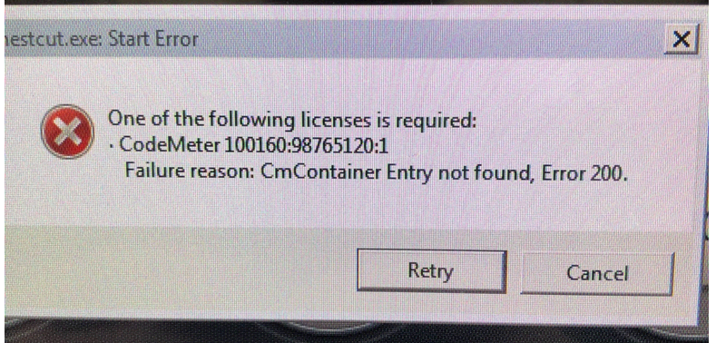

### Q: CodeMeter Runtime Error: Cm Container Entry not found, Error 200

### A1: Dongle damaged or runtime problem

 

1. Restart the PC / machine 
2. Plug out the CM Dongle 
3. Open the CodeMeter Control Center (Icon in the Windows Taskbar) by double clicking on it  
3.1 When no Windows taskbar is visible, open Windows Explorer and enter CodeMeterCC.exe as address and press enter
4. The icon should be colored gray, showing that no CM stick is inserted.
5. Re-Insert the GTR CM Dongle
6. The CM Dongle must now be shown in the control center.

### A2: License missing

This problem can also occur, when the requested license is not found on the plugged-in license key.

