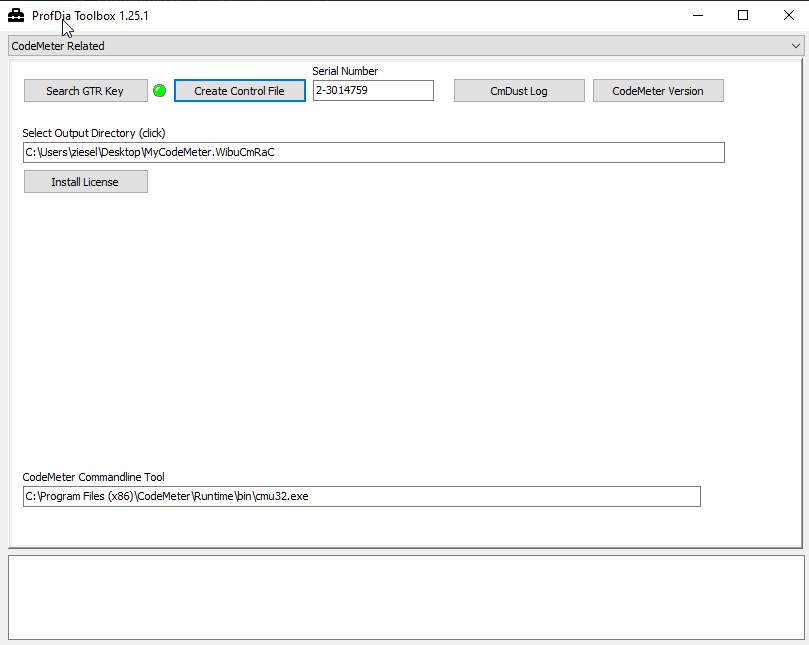

# CodeMeter

Use this function to gather inforamtion about a CodeMeter dongle. Just plug in your dongle into the PC and click **Search GTR Key**. After a few seconds the re LED will turn into a green LED. Also your CodeMeter **serial number** will be displayed.

If your dongle has been locked and you want to request a recoding, you can export your CodeMeter dongle configuration with "Create Control File". For this, a path must be set in "Select Output Directory". The created file has the name: "MyCodeMeter.WibuCmRaC". With this file attached to your mail we can do a recoding. Please also include the Serial Number of your dongle in your mail. 
 
If you want to install an update of the license on your dongle, then click on "Install License". An explorer window opens and asks you to select the update file. This file will be sent to you by GTR via e-mail and has the file extension ".WibuCmRaU".
