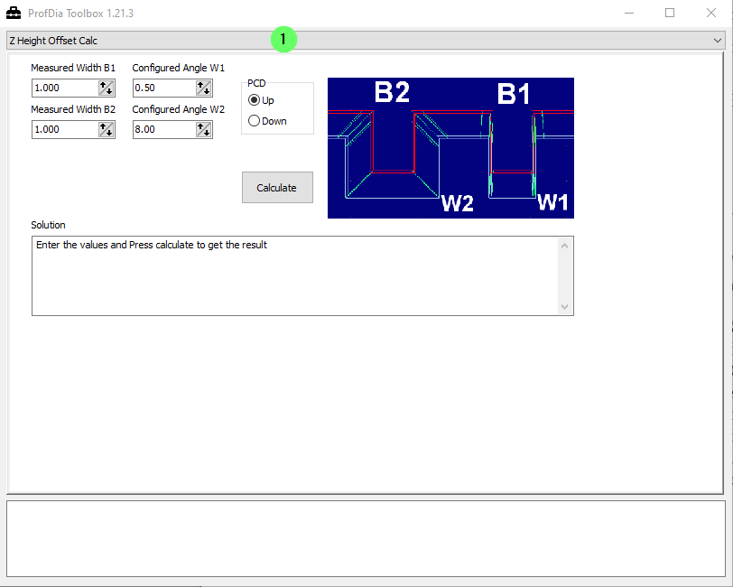
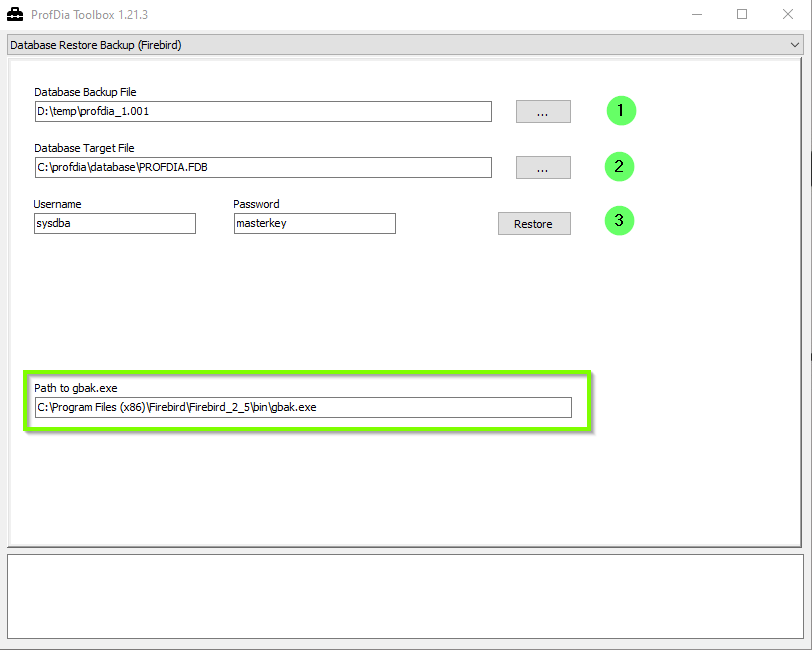
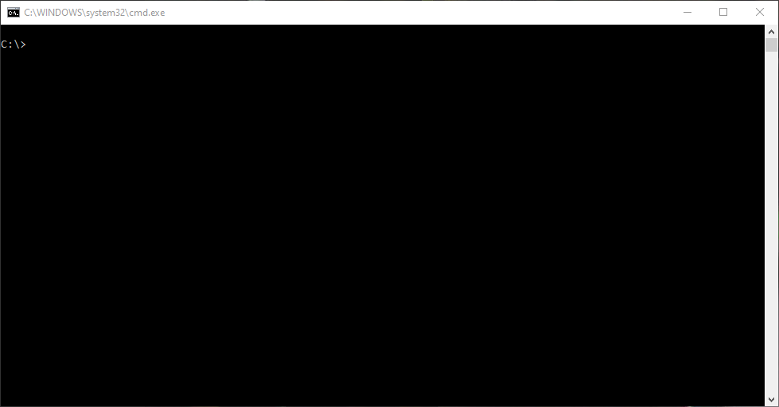
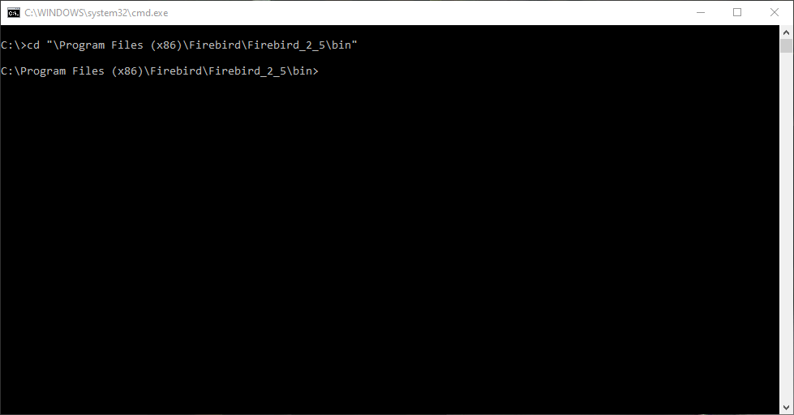
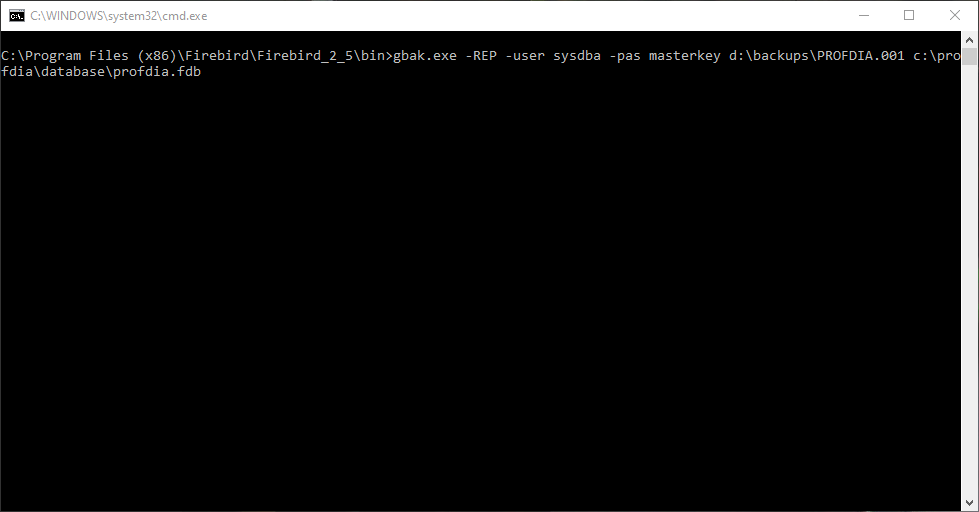

# Firebird database recovery

## Summary

With Firebird based software products from GTR, a freeware software called **GBAK Scheduler** [^1] is also installed. This software is doing a database backup.
This document describes the recovery process with a backup of the Firebird database made by the GBAK scheduler.

## General

The database backup files have different file extensions dependent on your backup pattern (smart or manual).

If the backup is made via the small-set, the file extensions are as follows:

- "dbname" .dl --> Daily Backup 
- "dbname" .wk --> Weekly Backup 
- "dbname" .mt --> Monthly Backup 

If a simple backup pattern (Plain Set) is selected the file extensions are purely numeric (.001 - .999).

To restore the Firebird database, the Firebird database server must be installed on the computer. The installation is done automatically with the GTR software.

The ProfDiaToolbox program is required to restore the respective database. This is installed by default in the program directory.

!!!warning "Warning"
    Before database recovery, all applications that access the database must be closed.
	If other computers access the database via the network, it must also be ensured that all accesses are terminated before the recovery process started.

## Recover the database

Start the ProfDiaToolbox application by double-clicking ProfDiaToolbox.exe in the installation directory.

Click on "1" and select **Database Restore Backup (Firebird)**.

The **Username** and **Password** fields are pre-populated with the default data for the database administrator.

If the Firebird server installation was found by ProfDiaToolbox, the **Path to gbak.exe** field is filled in as shown in the picture.

1: Click on ... to select backup file .
2: Click on ... to select database file to replace .
3: Click **Restore** to start the restore process. 

After pressing the **Restore** button, a black window appears with the actual restore process. As the window is closed again, the restore process is finished.

The ProfDiaToolbox can now be closed again. The database is now ready for use again.

!!!info "Hint for ProfDia Toolbox Versions <1.21.0"
    For older versions of ProfDia Toolbox, the following points must be observed:

	- for plain-set backups, the file extension must be adjusted manually in the backup file selection. To do this, enter ***** in the text field of the database name and confirm with Enter. This will display all files in the current directory. A selection of the backup file is thus easily possible.
	- Before the actual restore, the existing database file must be deleted or renamed.
	
	
## Manual database recovery using gbak.exe

It is possible to restore the database from the command line using gbak.exe. The gbak.exe can be found in the Firebird server installation directory. The default directory is:

- C:\\Program Files (x86)\\Firebird\\Firebird_2\_5\\bin

The installation directory can also be determined in the green box at the bottom of the graphic.
 

Command for recovery:

        gbak.exe -REP -user <Username> -pas <Password> <Backup File> <target File>

Example:

        gbak.exe -REP -user sysdba -pas masterkey d:\\backups\\PROFDIA.001 c:\\profdia\\database\\profdia.fdb

-   Open the command line by pressing Windows + **R**
-   Type **cmd**
-   Confirm by pressing **enter**

-   Go in the cmd window to your installation path

-  Insert the recivery command and confirm with **enter**

The recovery process is done!

[^1]: https://sites.google.com/site/gbakscheduler