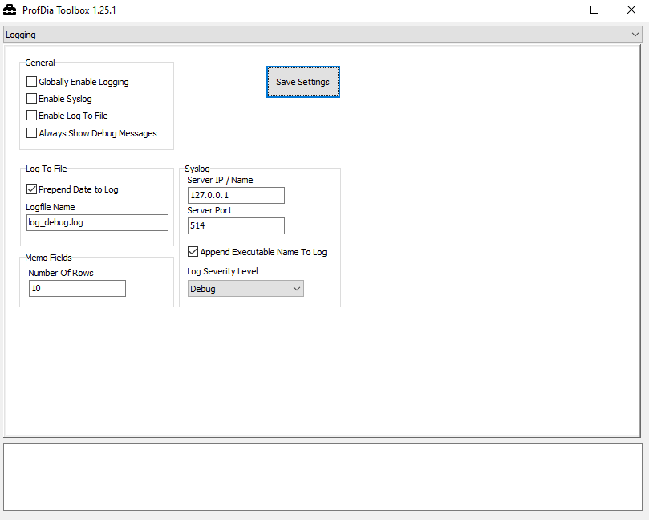

# Logging Settings

> [!info]
> The settings can be changed directly via the text editor in the logging.ini file.
> You can find the file at: C:\programdata\gtr mbh\logging.ini. 
> The path "programdata" is hidden by default.

With this function you can change your logging settings.

Save all changes by confirming with **Save Settings**.

> [!info]
> Normally you don't have to activate this function, in some times in consulation with GTR.
> Logging is deactivated by standart.

> [!warning]
> Active logging may impact the software performance.
