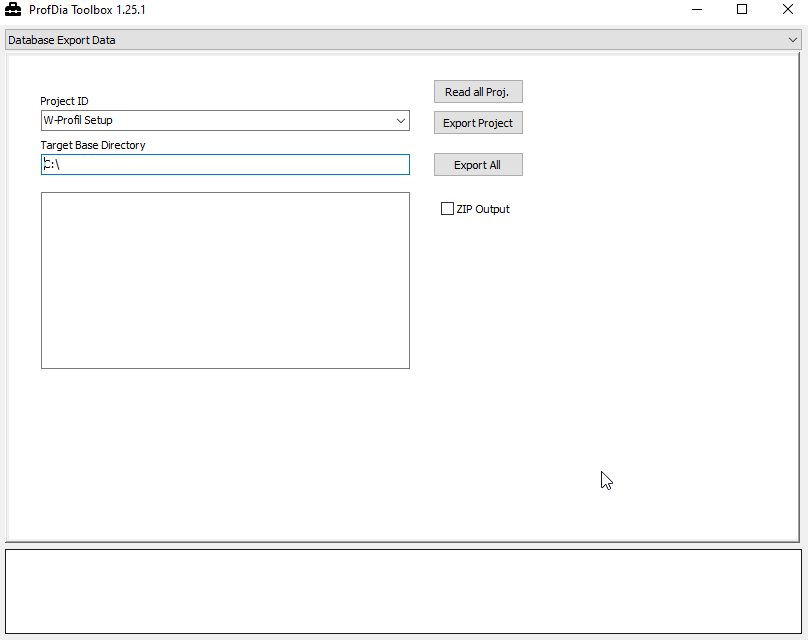

# Export Database Project

!!! info "Information"
    In principal this function is the same as the procect export function in ProfDia

By clicking the button **Read all Proj** all projects from the database are loaded. Select the project you want to export from the drop down menu **Project ID**.
In **Target Base directory** your output directory must be set.
If **ZIP output** is activated, your selected project will be exported as a ZIP file - otherwide your project files are saved directly into your output path.
You start the expport by clicking **Export Project**.

If you press the **Export All** button, all projects will be exported as ZIP files to the specified directory.

