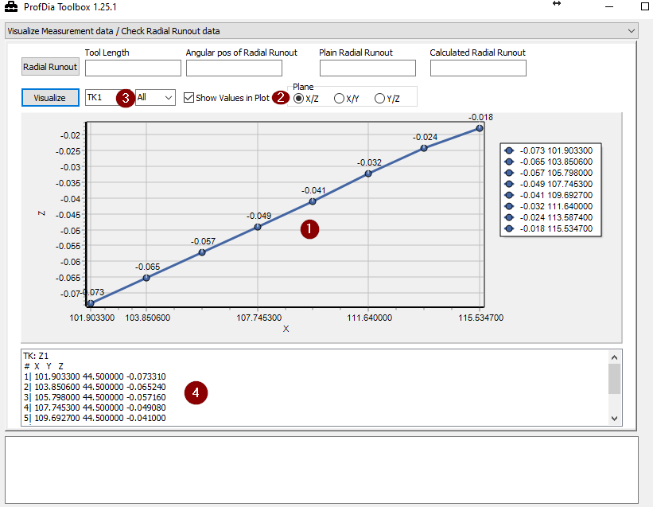

## Visualize Measurement Data

With this function you can evaluate grphically the latest measuring data from your current project.

!!! info "Information"
    
    To be able to read out this data, the following points must be observed:

    - The ProfDiaToolbox.exe must be in the same program directory as your installation
    - The project to be evaluated must be selected and activated in the project database

1: Graph with the measuring points and the plane set in "2 
2: Display plane of the graph, the X/Z plane represents the measured Z values over the length of the tool  
3: Selection between the different subcontours and if available their teeth 
4: Tabular display of raw values of the measuring points 

## Display the measurement result of the runout compensation

By clicking **Radial Runout** the latest measurement values will be loaded from the current project.

!!! info "Information"
    the project to be evaluated must be selected and acivated in the project database.

    